# PlatformClaw Architecture

PlatformClaw는 여러 사용자의 Personal Agent가 각자의 개인 개발 VM에 접속하고 Board Farm MCP를 사용하도록 격리하는 멀티유저 AI 엔지니어링 플랫폼이다. OpenClaw generic runtime에 enterprise identity, tenant authorization, credential, Knox와 hardware workflow를 명시적 owner boundary로 추가한다. 실선은 현재 코드 또는 Mock contract, 점선은 `INTERNAL_INTEGRATION_REQUIRED`인 사내 연결을 뜻한다.

## 1. System Context

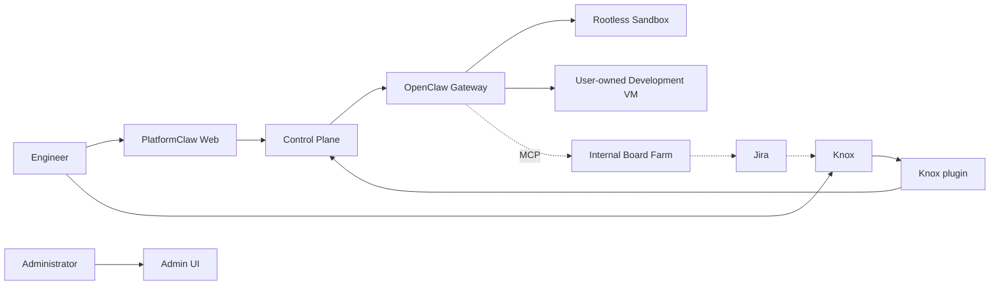

경로: `packages/platformclaw-control-plane/src/`, `extensions/knox/src/`, `extensions/platformclaw-execution/src/`, `docker/platformclaw-runtime/`. Board Farm/Jira actual 연결은 `IR-001`~`IR-007`.

## 2. Component Architecture

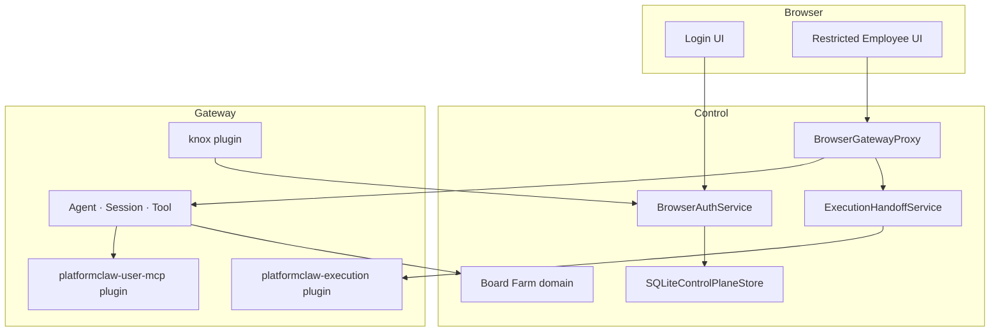

Component 경로:

- Login/UI: `ui/src/platformclaw/`
- Control: `packages/platformclaw-control-plane/src/`
- VM backend: `extensions/platformclaw-execution/src/`
- personal MCP: `extensions/platformclaw-user-mcp/src/`
- Knox: `extensions/knox/src/`
- Board Farm domain: `packages/platformclaw-control-plane/src/board-farm/`

## 3. Personal Request Sequence

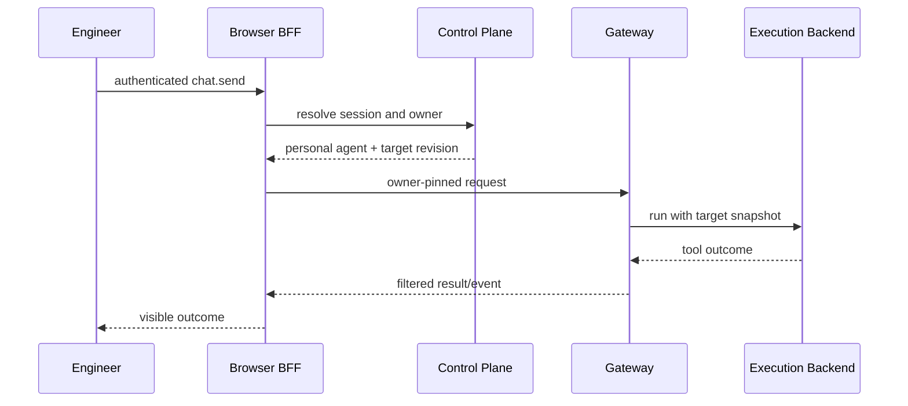

근거: `browser-gateway-proxy.ts`, `browser-gateway-ownership.ts`, `execution-handoff-service.ts`, `browser-gateway-proxy*.test.ts`.

## 4. Personal Agent Provisioning

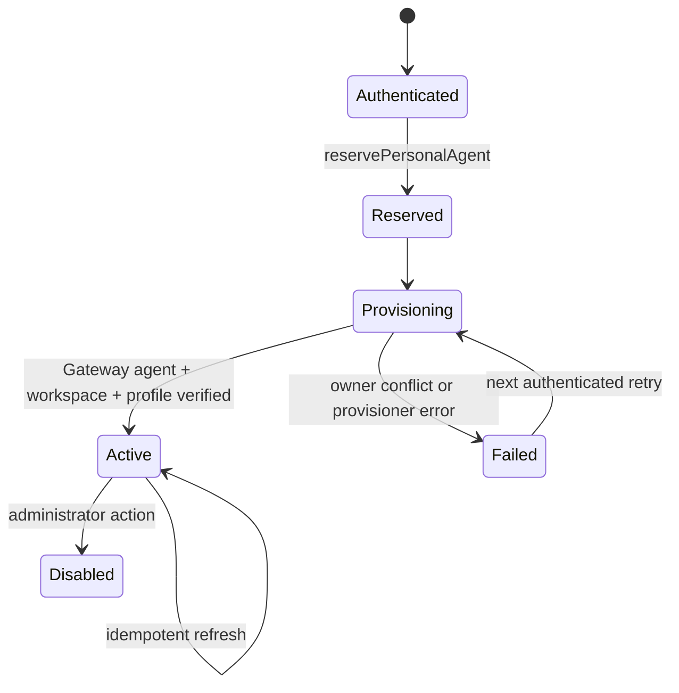

근거: `browser-auth-service.ts`, `personal-agent-provisioner.ts`, `restart-reconciler.ts`와 동명 테스트. Workspace/profiling conflict는 overwrite하지 않고 fail closed한다.

## 5. VM Execution

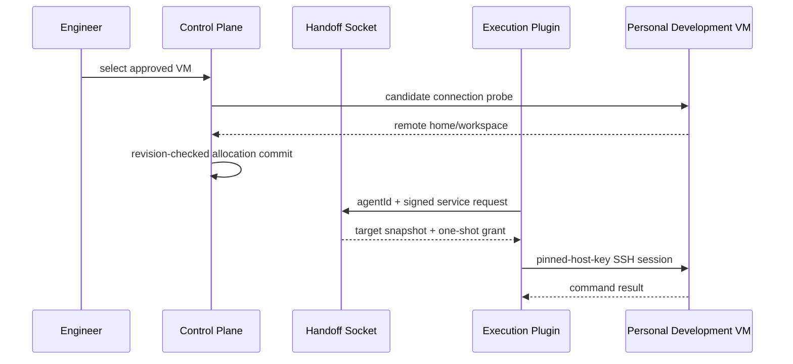

근거: `execution-contracts.ts`, `browser-execution-http.ts`, `execution-handoff-service.ts`, `extensions/platformclaw-execution/src/backend.ts`, `ssh-lease-manager.ts`.

## 6. Sandbox Execution

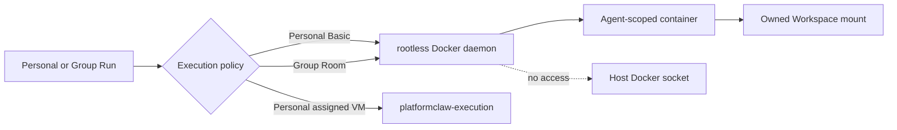

근거: `docker/platformclaw-runtime/compose.yaml`, `validate-managed-config.mjs`, `scripts/e2e/platformclaw-runtime-docker.sh`. Group은 `assigned_vm`을 선택하지 않는다.

## 7. Knox DM

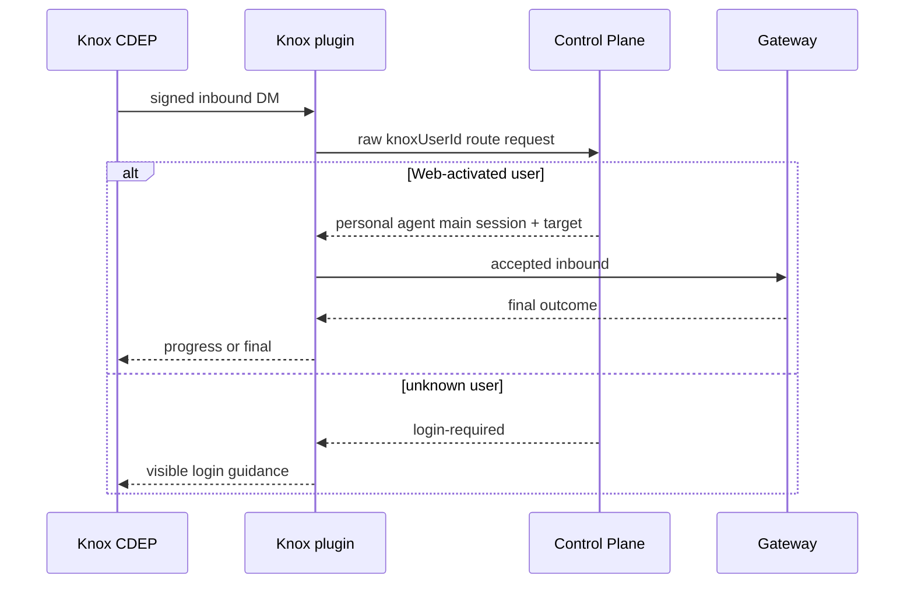

근거: `extensions/knox/src/inbound.ts`, `routing-client.ts`, `packages/platformclaw-control-plane/src/knox-routing-service.ts`. 실제 CDEP delivery는 `IR-007`.

## 8. Knox Group Room

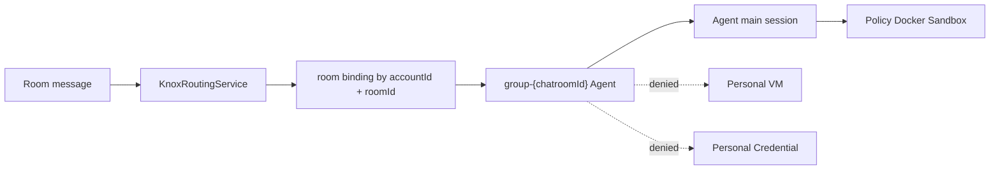

근거: `knox-routing-service.ts`, `knox-room-agent-provisioner.ts`, `knox-routing-service.test.ts`. External sender는 room Agent 호출만 가능하며 personal identity로 승격되지 않는다.

## 9. Board Farm MCP Lease와 Control

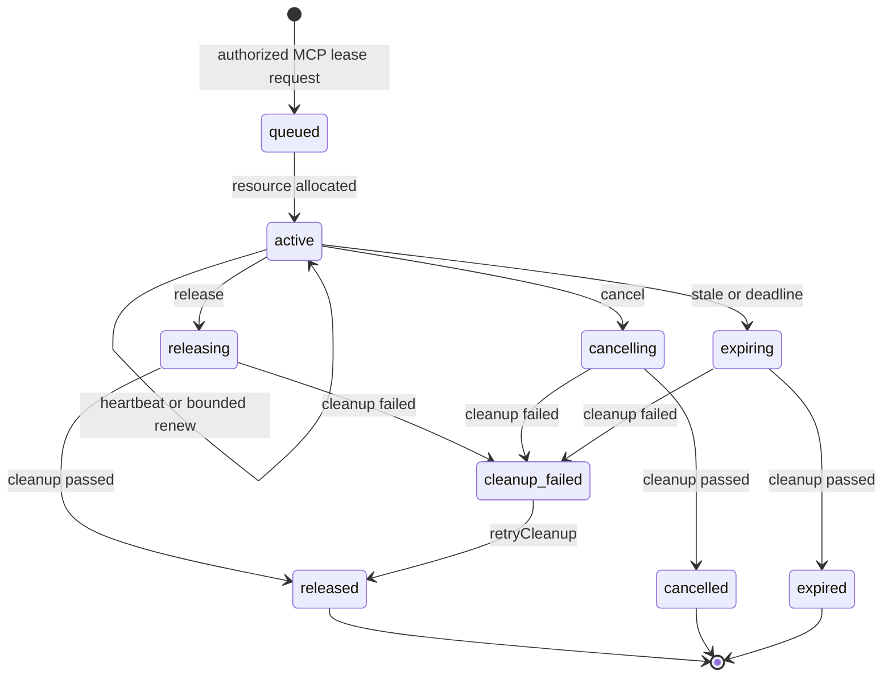

Domain 경로는 `packages/platformclaw-control-plane/src/board-farm/contracts.ts`, `service.ts`, `state-machine.ts`, `memory-store.ts`, `mock-adapter.ts`. 이 코드는 completed build result에서 시작하는 deterministic Mock harness이며 실제 MCP lease policy의 source of truth가 아니다. 실제 MCP Tool schema, lease·renew·control·release mapping과 auth는 `IR-001`, `IR-002`; 제출 외부 상태는 `MOCK_VERIFIED`다.

## 10. Hardware Validation

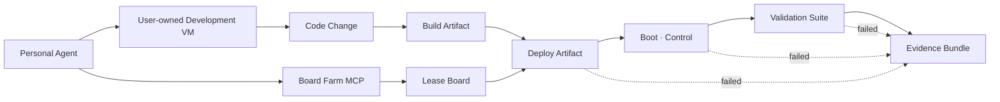

lease는 build status가 아니라 Board Farm MCP의 resource availability와 owner policy로 결정한다. artifact는 deploy 단계에서 필요하다. Mock adapter는 completed build result를 입력받아 이후 단계별 결과를 보존하지만 이 편의상 순서를 실제 MCP 정책으로 규정하지 않는다. 실제 Build Skill, Board Validation Skill과 board evidence는 `IR-004`, `IR-005`, `IR-009`다.

## 11. Evidence Flow

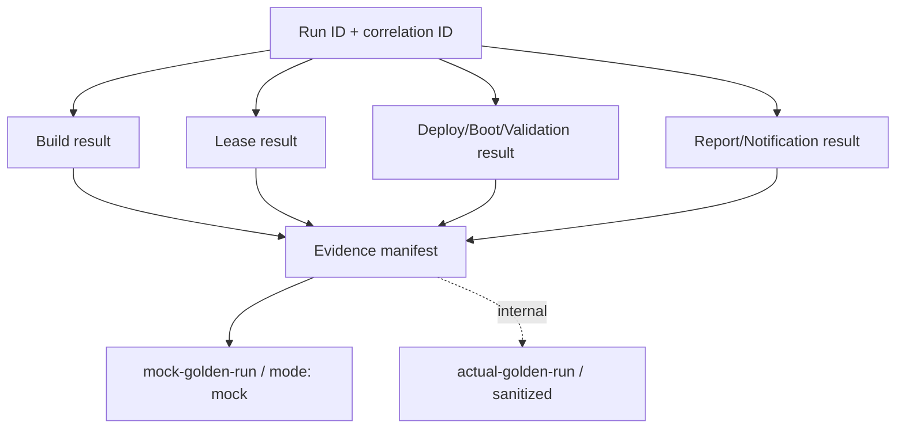

경로: `submission/evidence/mock-golden-run/`, `submission/evidence/actual-golden-run/`. Mock는 actual 근거로 승격되지 않는다.

## 12. Jira / Knox Result Flow

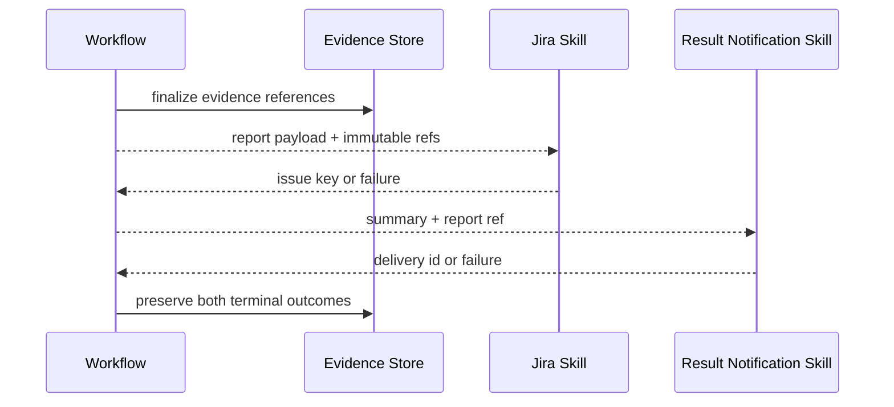

Templates: `submission/internal-templates/global-skills/jira-report/`, `result-notification/`. 실제 구현은 `IR-006`, `IR-007`.

## 13. Failure and Retry

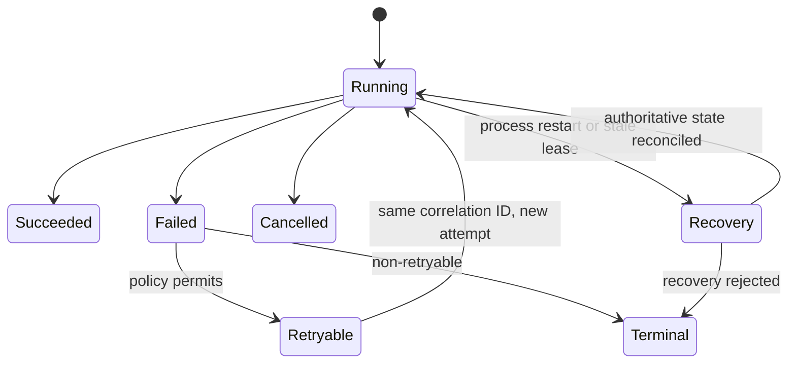

원칙: producer가 authoritative fact를 기록하고, retry는 idempotency key를 재사용하며, 실패 시 기존 evidence를 지우지 않는다. Control recovery 근거는 `restart-reconciler.ts`; Board lifecycle actual proof는 `IR-009`.

## 14. Credential Flow

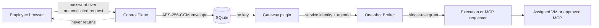

근거: `ssh-credential-crypto.ts`, `ssh-credential-vault.ts`, `ssh-credential-broker.ts`, `mcp-credential-*.ts`, `credential-broker-grants.ts`. Master key는 secret file에 있고 browser/Gateway state/Workspace에 없다.

## 15. Trust Boundary

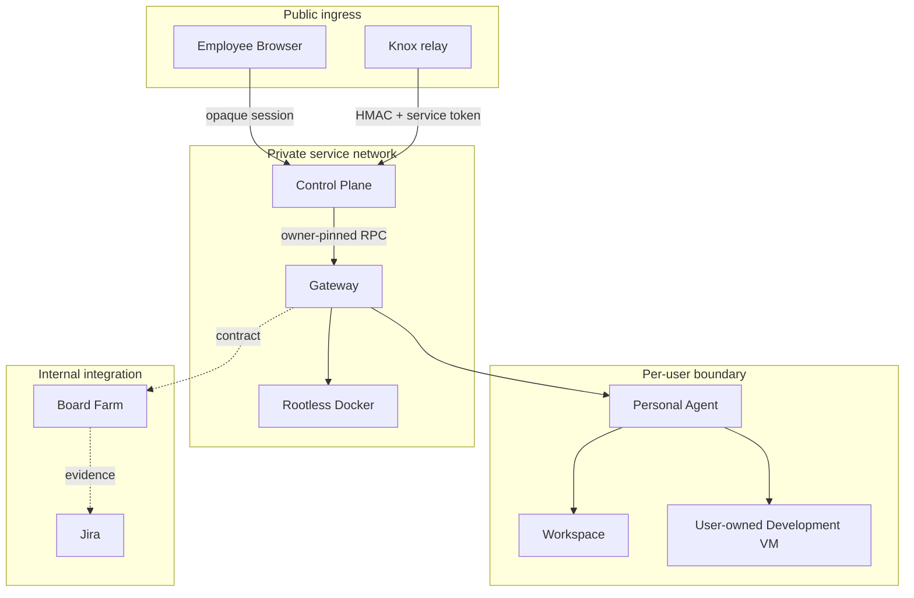

Employee BFF, admin listener, Gateway service identity, credential socket, Docker socket는 서로 다른 권한이다. 관련 경로: `web-ingress-server.ts`, `gateway-service-identity.ts`, `browser-vm-admin-http.ts`, Compose secret/volume 설정.

## 16. Deployment

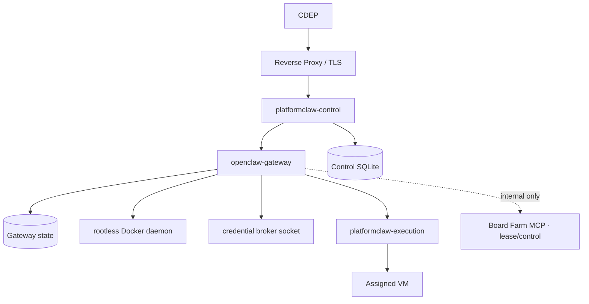

근거: `docker/platformclaw-runtime/compose.yaml`, `platformclaw-runtime-entrypoint`, `server-main.ts`, `scripts/platformclaw-build.mjs`. Reverse proxy와 internal endpoint 값은 deployment-owned configuration이며 source에 고정하지 않는다.

## Board Farm package 결정

Mock lease lifecycle은 전체 engineering Run의 user/Agent ownership을 검증하기 위해 `packages/platformclaw-control-plane/src/board-farm/`에 둔다. actual Board Farm lease·control은 사내 MCP가 소유하며 Control Plane은 authenticated user/Agent/Run context를 전달하고 결과를 기록한다. exact Tool schema를 모르는 외부 branch에서 Mock interface를 실제 MCP contract로 고정하지 않는다.

대안과 제한은 `docs/submission/13_DECISIONS_AND_TRADEOFFS.md`, 상세 계약은 `docs/submission/06_BOARD_FARM_MCP_CONTRACT.md`에 있다.
