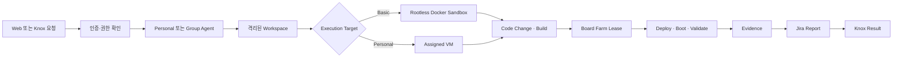

# PlatformClaw — Multi-user AI Engineering Platform

<p align="center">
  
</p>

PlatformClaw는 각 엔지니어에게 독립된 Assistant, Workspace, Execution Target과 정책 경계를 제공하고, 코드 변경부터 하드웨어 검증·증거·보고까지 하나의 추적 가능한 작업으로 연결하는 멀티유저 AI 엔지니어링 플랫폼이다.

> 제출 범위의 원칙: 실제 코드와 테스트가 있는 기능만 구현으로 표시한다. Board Farm, 사내 Global Skill, Jira 및 실제 Knox 전달은 계약과 Mock까지 준비되었으며, 사내 연결 전에는 `INTERNAL_INTEGRATION_REQUIRED`이다.

## 해결하는 문제

펌웨어·SoC 엔지니어링 업무는 요청, 코드, 빌드, VM, Board Farm, 결과 기록, Jira와 메신저 사이를 오간다. 이 과정에서 사용자별 자격 증명과 작업공간의 경계가 흐려지고, 실패 원인과 실행 증거가 흩어진다. PlatformClaw는 사용자와 그룹 Agent를 분리하고, 실행 대상을 명시적으로 고정하며, 후속 검증 단계에 증거를 전달하는 폐쇄형 workflow를 지향한다.

## Golden Path



현재 외부 환경에서는 인증·격리·VM/Sandbox·Knox routing의 코드 경계와 Board Farm 계약을 검증하고, 전체 흐름은 명시적인 Mock 결과로 재현한다. 실제 보드·Jira·Knox 전송 결과는 `submission/evidence/actual-golden-run/`이 채워지기 전까지 실제 근거가 아니다.

## 구현 상태

상태 정의는 [제출 문서 안내](docs/submission/README.md)를 따른다.

| 기능                                                     | 상태                            | 코드·테스트 근거                                                                                           | 제한                                   |
| -------------------------------------------------------- | ------------------------------- | ---------------------------------------------------------------------------------------------------------- | -------------------------------------- |
| Multi-user Control Plane, Employee Auth 계약             | `IMPLEMENTED_WITH_LIMITATIONS`  | `packages/platformclaw-control-plane/src/browser-auth-service.ts`, `browser-auth-service.test.ts`          | 실제 사내 인증 endpoint는 배포 시 설정 |
| Browser Session, 사용자·Agent·Session 권한 경계          | `IMPLEMENTED`                   | `packages/platformclaw-control-plane/src/browser-gateway-proxy.ts`, `browser-gateway-proxy*.test.ts`       | 외부 검증은 fixture 기반               |
| Idempotent Personal/Group Agent provisioning             | `IMPLEMENTED`                   | `personal-agent-provisioner.ts`, `knox-routing-service.ts` 및 동명 테스트                                  | 실제 Knox CDEP 운영 연결은 별도        |
| Personal VM, SafeConnect/SSH, one-shot credential broker | `IMPLEMENTED`                   | `packages/platformclaw-control-plane/src/execution-*.ts`, `extensions/platformclaw-execution/src/*.ts`     | 실제 사내 VM endpoint·계정은 필요      |
| Rootless Docker Sandbox routing                          | `IMPLEMENTED`                   | `docker/platformclaw-runtime/compose.yaml`, `scripts/e2e/platformclaw-runtime-docker.sh`                   | Linux Docker가 최종 검증 권위          |
| Personal MCP credential boundary                         | `IMPLEMENTED`                   | `packages/platformclaw-control-plane/src/mcp-credential-*.ts`, `extensions/platformclaw-user-mcp/src/*.ts` | 서버 목록은 관리자 설정                |
| Knox DM/Group routing 계약                               | `IMPLEMENTED_WITH_LIMITATIONS`  | `extensions/knox/src/*.ts`, `packages/platformclaw-control-plane/src/knox-routing-service*.ts`             | 실제 CDEP 전송은 `IR-007`              |
| Board Farm domain contract와 Mock workflow               | `MOCK_VERIFIED`                 | `packages/platformclaw-control-plane/src/board-farm/`, `submission/evidence/mock-golden-run/`              | 실제 adapter·인증은 `IR-001`, `IR-002` |
| 사내 Build/Validation/Jira/Notification Skill            | `INTERNAL_INTEGRATION_REQUIRED` | `submission/internal-templates/global-skills/`                                                             | `IR-003`~`IR-007`                      |
| Actual Golden Run과 5분 MP4                              | `INTERNAL_INTEGRATION_REQUIRED` | `submission/evidence/actual-golden-run/README.md`, `submission/video/`                                     | `IR-009`~`IR-011`                      |

## 외부 Mock 데모

사전 조건은 Node.js와 저장소의 pnpm toolchain이다. Windows linked worktree에서는 `pnpm install`을 실행하지 말고 기존 primary checkout의 dependency runtime을 재사용한다.

```bash
pnpm submission:test:mock
pnpm submission:verify:external
```

Mock 산출물은 `submission/evidence/mock-golden-run/`에 있고 모든 레코드에 `mode: mock`이 유지된다. 실제 보드 성능이나 사내 API 성공을 뜻하지 않는다.

## 검증

```bash
node scripts/platformclaw-check.mjs --changed --quick
pnpm submission:slides:check
pnpm submission:self-review
pnpm submission:verify:external
```

Linux Docker runtime smoke:

```bash
pnpm test:docker:platformclaw-runtime
```

사내 실제 연동을 마친 뒤에만 다음 gate를 실행한다.

```bash
pnpm submission:verify:final
```

## 코드와 제출 근거

- 제품 요구: [PRD.md](PRD.md)
- 구조와 trust boundary: [ARCHITECTURE.md](ARCHITECTURE.md)
- 항목별 평가 근거: [EVALUATION.md](EVALUATION.md)
- OpenClaw·기존 자산 출처: [ATTRIBUTION.md](ATTRIBUTION.md)
- 심사 요구사항 익명 요약: [docs/submission/00_EVALUATION_REQUIREMENTS.md](docs/submission/00_EVALUATION_REQUIREMENTS.md)
- 기능별 코드 지도: [docs/submission/12_CODE_MAP.md](docs/submission/12_CODE_MAP.md)
- claim 기준 파일: [submission/evaluation-map.yaml](submission/evaluation-map.yaml)
- 사내 인계: [docs/submission/14_INTERNAL_HANDOFF.md](docs/submission/14_INTERNAL_HANDOFF.md)
- 5분 데모 계획: [docs/submission/15_DEMO_PLAN.md](docs/submission/15_DEMO_PLAN.md)

## 제출에서 보이는 제품 Surface

Web login, 제한된 employee Control UI, 실행 대상, MCP 및 Skill 화면은 PlatformClaw 브랜드와 권한 경계를 사용한다. Telegram, WhatsApp, Discord, Slack, 모바일·데스크톱 app과 범용 consumer assistant 문구는 upstream 호환성과 dependency closure 때문에 삭제하지 않고 제출 runtime의 주 사용자 경로에서 숨긴 `RETAIN_BUT_HIDDEN`이다. 자세한 분류는 [01_PRODUCT_SCOPE.md](docs/submission/01_PRODUCT_SCOPE.md)에 있다.

## 출처와 해커톤 범위

이 저장소는 OpenClaw의 generic Gateway, Agent, Session, Tool, Plugin SDK와 Sandbox 기반을 유지한 private downstream이다. 해커톤 제출 구현은 fresh OpenClaw fork 위에 enterprise identity, multi-user authorization, personal execution, credential boundary, Knox policy, 운영 UI와 closed-loop hardware workflow 계약을 통합한다. 구형 Legacy PlatformClaw POC와 실제 사내 Board Farm·Skill 자산은 별도 기원이다. 상세 baseline과 범위는 [ATTRIBUTION.md](ATTRIBUTION.md)를 참조한다. 원 라이선스는 [LICENSE](LICENSE), 제3자 고지는 [THIRD_PARTY_NOTICES.md](THIRD_PARTY_NOTICES.md)에 보존된다.

## 사내에서 남은 작업

사내에서 수행할 항목은 `IR-001`~`IR-013`으로 중앙 관리한다. 실제 Board Farm adapter와 인증, Global Skills, Jira/Knox 연동, Golden Run, 실제 측정값, 영상, 최종 gate와 branch/tag만 남는다. 시작 명령과 정확한 순서는 [submission/INTERNAL_FINALIZATION_CHECKLIST.md](submission/INTERNAL_FINALIZATION_CHECKLIST.md)에 있다.

## 알려진 제한

- 외부 Mock 결과는 실제 하드웨어·Jira·Knox 결과가 아니다.
- 실제 사내 hostname, credential, 사용자 정보와 내부 문서는 저장소에 포함하지 않는다.
- 실제 비즈니스 시간 절감 수치는 Golden Run 전에 제시하지 않는다.
- assigned VM과 Knox production path는 배포 환경의 endpoint·secret·정책이 없으면 실행할 수 없다.
- 브라우저 UI의 숨김은 보안 경계가 아니다. 서버 request, response, event authorization이 최종 경계다.

마스코트는 제공된 공식 SVG를 비율·투명도·픽셀 형태를 바꾸지 않고 사용한다. 자산 용도와 출처는 [ATTRIBUTION.md](ATTRIBUTION.md)에 기록한다.
