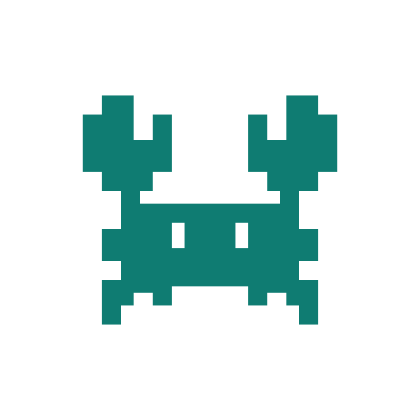
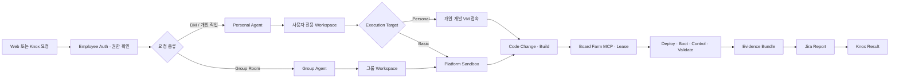
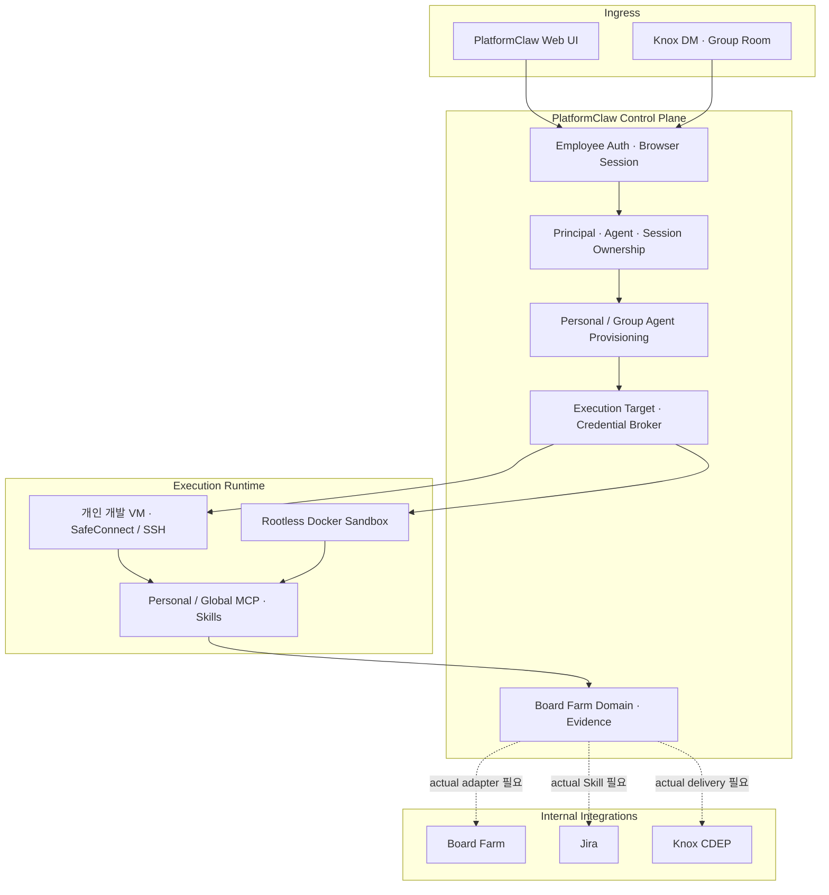

# PlatformClaw — Multi-user AI Engineering Platform

<p align="center">
  
</p>

PlatformClaw는 **여러 엔지니어가 각자의 Assistant를 통해 사용자 소유의 개인 개발 공간과 assigned VM에 안전하게 접속**하고, **코드 변경 → 빌드 → Board Farm MCP 보드 임대·제어 → 검증 → 증거 → Jira → Knox 결과**를 하나의 추적 가능한 Run으로 연결하는 멀티유저 AI 엔지니어링 플랫폼이다.

> **제출 범위 원칙** — 코드와 테스트가 있는 기능만 구현으로 표시한다. 외부에서 재현할 수 있는 전체 흐름은 명시적으로 `MOCK_VERIFIED`이며, 실제 Board Farm·사내 Global Skill·Jira·Knox·측정값은 actual evidence가 생길 때까지 `INTERNAL_INTEGRATION_REQUIRED`다.

## 3분 요약

| 질문                  | 답                                                                                                                                                                                                                                                               |
| --------------------- | ---------------------------------------------------------------------------------------------------------------------------------------------------------------------------------------------------------------------------------------------------------------- |
| 어떤 문제인가?        | 펌웨어·SoC 개발자는 요청, 코드, 개인 VM, 빌드 시스템, Board Farm, Jira와 메신저를 오가며 수동으로 맥락과 증거를 전달한다. 사용자별 자격 증명·작업공간 경계도 쉽게 흐려진다.                                                                                      |
| 무엇을 만들었나?      | Employee Auth, 사용자별 Agent·Workspace, 개인 개발 VM 접속, rootless Sandbox, one-shot credential, Knox 정책과 Board Farm 연동 경계를 하나의 멀티유저 플랫폼으로 통합했다.                                                                                       |
| 무엇이 실제 구현인가? | Control Plane, 소유권 검사, Agent provisioning, VM/Sandbox routing, credential vault/broker, MCP 경계, 제한된 Control UI와 Linux Docker runtime이다.                                                                                                             |
| 무엇이 Mock인가?      | VM build 결과를 받아 lease·deploy·boot·validation·report·Knox 결과까지 재현하는 closed-loop harness다. 실제 MCP의 Tool·인증·lease/control 정책을 대신하지 않으며 모든 산출물은 `mode: mock`이다.                                                                 |
| 무엇이 아직 필요한가? | 실제 사내 endpoint·정책·secret mount를 사용하는 Board Farm/Global Skill/Jira/Knox 연결, actual Golden Run, 측정값, 5분 MP4와 final branch/tag다.                                                                                                                 |
| 어디서 검증하나?      | [평가 근거](EVALUATION.md), [기능별 코드 지도](docs/submission/12_CODE_MAP.md), [machine-readable claim map](submission/evaluation-map.yaml), [Mock evidence](submission/evidence/mock-golden-run/)에서 claim → code → test → runtime evidence를 추적할 수 있다. |

## 해결하는 엔지니어링 문제

기존 흐름은 사람이 여러 시스템 사이에서 다음 정보를 반복해 옮긴다.

- 누가 요청했고 어느 Agent·Workspace·VM이 그 사용자의 것인지
- 어떤 source commit과 build artifact를 어느 보드에 배포했는지
- 실패가 build, lease, boot, validation, report 중 어디에서 발생했는지
- 결과와 로그를 Jira와 메신저에 어떻게 안전하게 전달할지

PlatformClaw는 이 경계를 Control Plane이 소유하게 한다. 브라우저나 채널은 제품 정책을 추측하지 않고, 인증된 principal과 Agent owner, 사용자에게 할당된 개인 개발 VM, 고정된 execution target과 Run correlation ID를 따라간다. 자격 증명은 저장된 암호화 envelope에서 실행 시점의 one-shot handoff로만 전달한다. Board Farm MCP는 개인 VM 실행 backend와 분리된 도구 경계에서 보드 lease와 control을 제공한다.

## Golden Path



핵심 정책은 두 가지다.

1. Personal Agent는 사용자의 기존 개인 개발 공간인 assigned VM에 접속해 그 Workspace에서 코드를 수정하고 빌드할 수 있다. 여러 사용자의 Agent·Workspace·VM·credential은 서로 섞이지 않는다.
2. Group Agent는 개인 VM·개인 credential을 상속하지 않고 platform Sandbox와 그룹 경계만 사용한다.

현재 외부 환경에서는 인증·소유권·VM/Sandbox·credential·Knox routing의 코드 경계와 Board Farm domain contract를 검증한다. 전체 closed loop는 deterministic Mock으로 재현한다. 실제 보드·Jira·Knox 성공은 [actual evidence 디렉터리](submission/evidence/actual-golden-run/)가 채워지고 final gate를 통과하기 전까지 주장하지 않는다.

## 평가 항목에 대한 명확한 답

공식 비중은 기술성 30%, 창의성 25%, 완성도 20%, 비즈니스 가치 15%, 전달력 10%다. 아래는 각 독립 평가 Agent가 README만 읽어도 찾을 수 있는 답과 한계다. 상세 claim은 [EVALUATION.md](EVALUATION.md), 상태의 최종 기준은 [submission/evaluation-map.yaml](submission/evaluation-map.yaml)이다.

### 기술성 30% — 무엇이 기술적으로 어려웠나?

**답:** 하나의 AI runtime에 여러 사용자의 identity, Agent, session, Workspace, VM, MCP credential과 하드웨어 lease를 연결하면서 교차 사용자 접근과 stale target 실행을 막는 것이 핵심 난제다. PlatformClaw는 이 사실을 소비자가 추론하게 두지 않고 Control Plane의 owner boundary에 기록한다.

- request·result·event·session·file·artifact에 동일한 owner authorization 적용
- 동시 로그인 시 personal Agent provisioning single-flight와 restart reconciliation
- assigned VM target revision 고정, SafeConnect/SSH bounded master lease
- SSH·MCP credential 암호화 저장과 local one-shot broker grant
- Board Farm lease의 owner authorization, FIFO/heartbeat/renew/expire/cancel/cleanup state machine
- rootless Docker daemon과 host Docker socket 분리

**현재 판정:** 핵심 Control Plane·VM·credential·Sandbox는 `IMPLEMENTED`; Board Farm closed loop는 `MOCK_VERIFIED`; actual adapter/auth는 `INTERNAL_INTEGRATION_REQUIRED`.

**직접 근거:** [Control Plane](packages/platformclaw-control-plane/src/), [execution plugin](extensions/platformclaw-execution/src/), [Board Farm domain](packages/platformclaw-control-plane/src/board-farm/), [Docker runtime smoke](scripts/e2e/platformclaw-runtime-docker.sh), [보안 구조](docs/submission/03_SECURITY_AND_ISOLATION.md).

### 창의성 25% — 기존 AI assistant와 무엇이 다른가?

**답:** 채팅이나 코드 생성에서 끝나지 않고, 기업 identity를 사용자별 개인 개발 VM과 연결하고 그 실행 결과를 하드웨어 lease·control·evidence·report까지 하나의 Run으로 결합한다. 핵심 신규 가치는 multi-user engineering control plane과 hardware-validation integration boundary다.

- Knox DM은 개인 Agent와 선택 target으로, Group Room은 방 전용 Agent와 platform Sandbox로 분리
- channel이 문자열을 보고 정책을 추측하지 않고 Control Plane이 route와 target을 결정
- 실제 Board Farm MCP의 exact Tool mapping은 사내에서 연결하고, 외부에서는 별도 deterministic Mock harness로 흐름과 evidence 형식만 검증
- Mock 결과도 actual처럼 보이게 포장하지 않고 manifest와 모든 결과에 `mode: mock` 유지

**현재 판정:** policy integration은 `IMPLEMENTED_WITH_LIMITATIONS`; 전체 hardware loop는 `MOCK_VERIFIED`.

**직접 근거:** [Knox routing](packages/platformclaw-control-plane/src/knox-routing-service.ts), [Knox plugin](extensions/knox/src/), [Board Farm service](packages/platformclaw-control-plane/src/board-farm/service.ts), [Mock manifest](submission/evidence/mock-golden-run/manifest.json).

### 완성도 20% — 실제로 어디까지 동작하고 검증되는가?

**답:** login, restricted Control UI, personal Agent provisioning, owner-aware Gateway proxy, VM/Sandbox 선택, MCP 설정과 Linux Docker runtime이 구현되어 있다. 로딩·오류·재시도·재연결과 cross-user denial도 테스트한다. 제출 스크립트는 문서, HTML slides, claim map, evidence mode와 내부 미완료 항목을 자동 검증한다.

**현재 판정:** 외부 demo surface는 `MOCK_VERIFIED`; 실제 hardware/Jira/Knox 및 5분 MP4는 `INTERNAL_INTEGRATION_REQUIRED`.

**직접 근거:** [PlatformClaw UI](ui/src/platformclaw/), [UI E2E](ui/src/e2e/), [web ingress](packages/platformclaw-control-plane/src/web-ingress-server.ts), [submission checks](scripts/submission/), [CI workflow](.github/workflows/platformclaw-submission.yml).

### 비즈니스 가치 15% — 어디에 적용되고 어떤 효과가 있는가?

**답:** 펌웨어·SoC 엔지니어의 기존 작업 진입점에서 개인 VM, build, Board Farm, Jira와 Knox handoff를 자동화하고, Run 단위 증거를 남기는 것이 적용 지점이다. 기대 효과는 tool switching, 수동 evidence 정리, 실패 원인 추적과 handoff 시간을 줄이는 것이다.

**정직한 한계:** 구조와 측정 정의는 준비됐지만 실제 시간 절감 수치는 아직 없다. 동일 baseline과 actual Golden Run으로 lead time, 수동 handoff 수, 자동 evidence 수집률, 재시도 성공률을 측정하기 전에는 수치를 주장하지 않는다.

**현재 판정:** 적용 구조는 `IMPLEMENTED_WITH_LIMITATIONS`; 실제 효과 측정은 `INTERNAL_INTEGRATION_REQUIRED`.

**직접 근거:** [비즈니스 가치와 측정 계획](docs/submission/11_BUSINESS_VALUE.md), [actual Golden Run 요구](docs/submission/14_INTERNAL_HANDOFF.md), [IR-009·IR-010](submission/internal-requirements.yaml).

### 전달력 10% — 주장과 증거를 어떻게 연결했나?

**답:** README의 요약에서 상세 문서, source, test, Mock/actual evidence까지 같은 claim ID와 상태 어휘로 연결한다. 코드가 있어도 runtime proof가 필요한 claim은 evidence가 없으면 완성으로 승격하지 않는다.

**현재 판정:** 문서·claim map·외부 gate는 `IMPLEMENTED`; actual evidence와 5분 MP4가 필요한 final gate는 `INTERNAL_INTEGRATION_REQUIRED`.

**직접 근거:** [평가 문서](EVALUATION.md), [claim map](submission/evaluation-map.yaml), [제출 manifest](submission/SUBMISSION_MANIFEST.md), [HTML slides](submission/slides/index.html), [5분 데모 계획](docs/submission/15_DEMO_PLAN.md).

## 시스템 구조



보안 경계의 최종 권위는 UI 숨김이 아니라 서버 request, response와 event authorization이다. 자세한 trust boundary와 failure model은 [ARCHITECTURE.md](ARCHITECTURE.md)에 있다.

## 저장소 구조

이 저장소는 외부 기반의 Git ancestry와 generic runtime을 보존한 downstream이다. 따라서 전체 저장소가 PlatformClaw 신규 코드인 것은 아니다. 심사에 직접 관련된 구조는 다음과 같다.

```text
platformclaw/
├─ packages/platformclaw-control-plane/  # identity, ownership, VM, credential, Board Farm owner
│  └─ src/board-farm/                    # deterministic Mock lifecycle과 evidence harness
├─ extensions/
│  ├─ platformclaw-execution/            # 사용자 소유 개인 개발 VM / Sandbox 접속 backend
│  ├─ platformclaw-user-mcp/             # 사용자별 MCP credential injection
│  ├─ knox/                              # Knox transport와 CDEP contract
│  └─ admin-http-rpc/                    # 제한된 관리자 RPC
├─ ui/src/platformclaw/                  # login, branding, execution/MCP/admin UI
├─ docker/platformclaw-runtime/          # Ubuntu Linux 배포, secret mount, rootless Sandbox
├─ scripts/
│  ├─ e2e/platformclaw-runtime-docker.sh # 실제 Docker runtime smoke
│  └─ submission/                        # claim/evidence/docs/slides/final gate
├─ docs/submission/                      # 심사용 설계·운영·보안·인계 문서
├─ submission/
│  ├─ evidence/mock-golden-run/          # 외부 재현 가능, 항상 mode: mock
│  ├─ evidence/actual-golden-run/        # 사내 실제 Run 전에는 비어 있어야 함
│  ├─ internal-templates/                # Board Farm·Global Skill 내부 연결 계약
│  ├─ slides/index.html                  # offline 프로젝트 소개서
│  └─ video/                             # 5분 MP4 규칙과 최종 산출물 위치
├─ src/, packages/, extensions/          # 보존된 generic core와 plugin ecosystem
├─ PRD.md                                # 제품 요구
├─ ARCHITECTURE.md                       # architecture와 trust boundary
├─ EVALUATION.md                         # 평가 항목별 서술 근거
└─ ATTRIBUTION.md                        # upstream·legacy·해커톤 범위 분리
```

| 계층            | 책임                                                          | 여기서 확인할 것                                                                    |
| --------------- | ------------------------------------------------------------- | ----------------------------------------------------------------------------------- |
| Product owner   | `packages/platformclaw-control-plane/`                        | 사용자·Agent·session·target·credential의 authoritative state와 Mock lease lifecycle |
| Plugin boundary | PlatformClaw `extensions/`                                    | 실행 backend, Knox transport, per-user MCP처럼 owner별 integration                  |
| Operator UX     | `ui/src/platformclaw/`                                        | employee login, 제한된 navigation, execution/MCP/admin 상태                         |
| Runtime         | `docker/platformclaw-runtime/`                                | Linux composition, read-only/secret mount, private Gateway, rootless Sandbox        |
| Proof           | `scripts/e2e/`, `scripts/submission/`, `submission/evidence/` | 실제 runtime smoke와 Mock/actual이 분리된 제출 근거                                 |
| Upstream base   | generic `src/`, `packages/`, `extensions/`                    | Gateway, Agent, Session, Tool, Plugin SDK 호환성                                    |

전체 path의 `KEEP` / `RETAIN_BUT_HIDDEN` / `REMOVE` 분류는 [제품 범위표](docs/submission/01_PRODUCT_SCOPE.md), 기능 단위 source·test·runtime 연결은 [Code Map](docs/submission/12_CODE_MAP.md)에서 확인할 수 있다.

## 구현 상태와 증거

상태 어휘의 정의는 [제출 문서 안내](docs/submission/README.md)를 따른다.

| 기능                                                      | 상태                            | 코드·테스트·runtime 근거                                                                                                                                                       | 남은 경계                                         |
| --------------------------------------------------------- | ------------------------------- | ------------------------------------------------------------------------------------------------------------------------------------------------------------------------------ | ------------------------------------------------- |
| Multi-user Control Plane · Employee Auth contract         | `IMPLEMENTED_WITH_LIMITATIONS`  | [browser auth](packages/platformclaw-control-plane/src/browser-auth-service.ts), 동명 test                                                                                     | 실제 사내 IdP endpoint는 배포 시 설정             |
| Browser session · user/Agent/session authorization        | `IMPLEMENTED`                   | [Gateway proxy](packages/platformclaw-control-plane/src/browser-gateway-proxy.ts), proxy/session tests                                                                         | 외부 인증 fixture 사용                            |
| Idempotent personal/group Agent provisioning              | `IMPLEMENTED`                   | [personal provisioner](packages/platformclaw-control-plane/src/personal-agent-provisioner.ts), [Knox routing](packages/platformclaw-control-plane/src/knox-routing-service.ts) | 실제 Knox 운영 delivery 별도                      |
| 개인 개발 VM 접속 · SafeConnect/SSH · one-shot credential | `IMPLEMENTED`                   | [execution source](packages/platformclaw-control-plane/src/), [execution plugin](extensions/platformclaw-execution/src/)                                                       | 실제 VM endpoint·계정 필요                        |
| Rootless Docker Sandbox routing                           | `IMPLEMENTED`                   | [runtime compose](docker/platformclaw-runtime/compose.yaml), [Docker smoke](scripts/e2e/platformclaw-runtime-docker.sh)                                                        | Linux Docker가 최종 권위                          |
| Personal MCP credential boundary                          | `IMPLEMENTED`                   | [MCP control-plane source](packages/platformclaw-control-plane/src/), [user MCP plugin](extensions/platformclaw-user-mcp/src/)                                                 | 실제 server registry는 관리자 설정                |
| Knox DM/Group routing contract                            | `IMPLEMENTED_WITH_LIMITATIONS`  | [Knox plugin](extensions/knox/src/), routing tests                                                                                                                             | actual CDEP delivery는 `IR-007`                   |
| Board Farm lifecycle · closed-loop Mock                   | `MOCK_VERIFIED`                 | [Board Farm source](packages/platformclaw-control-plane/src/board-farm/), [Mock evidence](submission/evidence/mock-golden-run/)                                                | actual MCP lease/control/auth는 `IR-001`·`IR-002` |
| Build/Validation/Jira/Notification Global Skills          | `INTERNAL_INTEGRATION_REQUIRED` | [sanitized templates](submission/internal-templates/global-skills/)                                                                                                            | `IR-003`~`IR-007`                                 |
| Actual Golden Run · measured value · 5분 MP4              | `INTERNAL_INTEGRATION_REQUIRED` | [actual evidence contract](submission/evidence/actual-golden-run/), [video checklist](submission/video/FINAL_VIDEO_CHECKLIST.md)                                               | `IR-009`~`IR-011`                                 |

## 외부에서 재현하는 Mock 데모

사전 조건은 Node.js와 저장소의 pnpm toolchain이다.

```bash
pnpm submission:test:mock
pnpm submission:verify:external
```

생성 결과는 [submission/evidence/mock-golden-run/](submission/evidence/mock-golden-run/)에 있다. manifest와 단계별 JSON의 `mode: mock` 표시는 실제 하드웨어·Jira·Knox 성공으로 오해되지 않게 하는 검증 대상이다.

Linux Docker runtime 전체 smoke:

```bash
pnpm test:docker:platformclaw-runtime
```

주요 source/test/docs와 제출 산출물을 한 번에 점검:

```bash
node scripts/platformclaw-check.mjs --changed --quick
pnpm submission:slides:check
pnpm submission:self-review
pnpm submission:verify:external
```

사내 실제 연동을 마친 뒤에만 다음 evidence-only gate를 실행한다.

```bash
pnpm submission:verify:final
```

이 gate는 actual manifest, 실제 build/lease/validation/report/Knox result, business metrics, screenshot, 5분 이내 MP4와 동일 source commit을 모두 요구한다. Mock evidence를 actual로 승격하지 않는다.

## 문서와 제출물

| 목적                        | 문서                                                                                           |
| --------------------------- | ---------------------------------------------------------------------------------------------- |
| 제품 요구                   | [PRD.md](PRD.md)                                                                               |
| 구조·trust boundary         | [ARCHITECTURE.md](ARCHITECTURE.md)                                                             |
| 평가 항목별 상세 답         | [EVALUATION.md](EVALUATION.md)                                                                 |
| 기능별 코드 지도            | [docs/submission/12_CODE_MAP.md](docs/submission/12_CODE_MAP.md)                               |
| 공식 요구사항 익명 요약     | [docs/submission/00_EVALUATION_REQUIREMENTS.md](docs/submission/00_EVALUATION_REQUIREMENTS.md) |
| machine-readable claim 기준 | [submission/evaluation-map.yaml](submission/evaluation-map.yaml)                               |
| 외부 준비 결과              | [docs/submission/16_EXTERNAL_PREP_REPORT.md](docs/submission/16_EXTERNAL_PREP_REPORT.md)       |
| 내부 연결 절차              | [submission/INTERNAL_FINALIZATION_CHECKLIST.md](submission/INTERNAL_FINALIZATION_CHECKLIST.md) |
| HTML 소개서                 | [submission/slides/index.html](submission/slides/index.html)                                   |
| 5분 demo scenario           | [docs/submission/15_DEMO_PLAN.md](docs/submission/15_DEMO_PLAN.md)                             |
| 출처·POC·해커톤 범위        | [ATTRIBUTION.md](ATTRIBUTION.md)                                                               |

## 출처와 해커톤 구현 범위

기존 POC는 컨셉 가능성만 확인했으며 source를 현재 저장소에 복사하거나 재사용하지 않았다. 현재 PlatformClaw 제품 구현은 모두 해커톤 기간에 개발했다. 확인된 최초 제품 commit은 2026-07-18의 `7b58338354708179ae4303363b0c9af0a90e4f92`이고, 확인된 upstream common ancestor와 제출 baseline도 모두 7월 3일 이후다. 외부 기반, Git 근거와 법적 고지는 [ATTRIBUTION.md](ATTRIBUTION.md)에 분리했다.

제출과 무관한 upstream consumer channel·native app 경로는 package exports, plugin build, protocol guard와 test classifier의 dependency closure 때문에 source tree에 남아 있지만, 제출 runtime에서 구성·빌드·노출하지 않는 `RETAIN_BUT_HIDDEN`이다. README·UI·slides·demo·지원 기능 목록은 PlatformClaw 경로만 보여 준다. 삭제 audit와 상세 구분은 [ATTRIBUTION.md](ATTRIBUTION.md), path별 scope는 [01_PRODUCT_SCOPE.md](docs/submission/01_PRODUCT_SCOPE.md)에 있다. 원 라이선스는 [LICENSE](LICENSE), 제3자 고지는 [THIRD_PARTY_NOTICES.md](THIRD_PARTY_NOTICES.md)에 보존한다.

## 사내에서 남은 Requirement

“남은 사내 작업”은 추상적인 TODO가 아니라 [submission/internal-requirements.yaml](submission/internal-requirements.yaml)의 검증 가능한 `IR-001`~`IR-013`이다.

| 범위             | Requirement       | 완료 조건                                                                                                              |
| ---------------- | ----------------- | ---------------------------------------------------------------------------------------------------------------------- |
| 실제 integration | `IR-001`~`IR-007` | actual Board Farm MCP lease/control/auth/Tool mapping, Global Skill provenance, build/validation/Jira/Knox result 생성 |
| 정책·실행·측정   | `IR-008`~`IR-010` | sanitized internal policy 반영, 같은 commit의 actual Golden Run, screenshot·business metric 검증                       |
| 제출 마감        | `IR-011`~`IR-013` | 5분 이내 MP4, 모든 final gate와 CI green, final branch push와 tag 확인                                                 |

각 항목에는 필요한 내부 정보, secret 입력 경계, 실행 명령, 예상 결과, 실패 위치, evidence path와 final gate rule이 정의되어 있다. 실제 endpoint·credential·사내 사용자 정보는 저장소에 넣지 않는다. 정확한 실행 순서는 [Internal Finalization Checklist](submission/INTERNAL_FINALIZATION_CHECKLIST.md)에 있다.

## 알려진 제한

- Mock Golden Run은 실제 하드웨어·Jira·Knox 결과가 아니다.
- 실제 사내 hostname, credential, 사용자 정보와 내부 문서는 저장소에 포함하지 않는다.
- 실제 비즈니스 시간 절감 수치는 actual Golden Run 전에는 제시하지 않는다.
- assigned VM과 Knox production path는 배포 환경의 endpoint·secret·정책이 없으면 실행할 수 없다.
- 브라우저 UI의 숨김은 보안 경계가 아니다. 서버 request, response와 event authorization이 최종 경계다.
- 실제 evidence와 5분 이내 최종 MP4가 없으므로 현재 branch는 제출 준비 branch이지 최종 제출 완료 branch가 아니다.

마스코트는 제공된 공식 SVG를 비율·투명도·픽셀 형태를 바꾸지 않고 사용한다. 자산 용도와 출처는 [ATTRIBUTION.md](ATTRIBUTION.md)에 기록한다.
