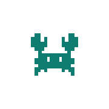

<div align="center">



# PlatformClaw

**Enterprise AI agents for engineering teams.**

Personal agents · Shared knowledge · Skill Hub · Managed execution

[Architecture](docs/platformclaw/index.md) ·
[Wiki Hub](docs/platformclaw/memory-wiki.md) ·
[Skill Hub](docs/platformclaw/skill-hub.md) ·
[Security](SECURITY.md) ·
[Development](#development)

[](https://github.com/devSejung/platformclaw/actions/workflows/platformclaw-ci.yml)
[](https://github.com/openclaw/openclaw)
[](LICENSE)

</div>


PlatformClaw turns OpenClaw into a governed, multi-user workspace with enterprise identity,
personal agents, shared knowledge, reusable skills, and managed execution — without turning the
upstream runtime into an enterprise fork.

## One workspace, from request to reusable knowledge

The personal agent workspace is the front door. An engineer can review a change, run the right checks,
pull in approved context, and decide what should remain task-specific versus what should become durable
team knowledge.

<p align="center">
  
</p>

The important part is what happens after the answer: reusable guidance can move into a Shared Wiki,
and repeatable procedures can become managed skills instead of disappearing into one thread.

## Knowledge and capability that stay with the team

### Wiki Hub

Personal and Shared Wikis live next to the agent, with vault discovery, content search, access-aware
AI reference, document lifecycle, and organization permissions.

<p align="center">
  
</p>

### Skill Hub

Repeatable engineering work becomes a searchable internal catalog with explicit versions, ownership,
visibility, install targets, and scanning policy.

<p align="center">
  
</p>

> All product screenshots are rendered from the current PlatformClaw frontend with deterministic demo data.
> They are not design mockups and contain no production user data.

## Why PlatformClaw exists

- **Personal by default.** Each employee gets a stable personal agent, isolated browser/session boundary,
  and user-scoped workspace context instead of sharing one operator identity.
- **Knowledge survives the thread.** Personal and Shared Wikis make durable engineering context searchable,
  permission-aware, and explicitly selectable for AI reference.
- **Capability becomes reusable.** Skill Hub and enterprise MCP turn repeatable work into managed team
  capability instead of prompt fragments copied between chats.
- **Execution has boundaries.** Work runs only on approved Docker or assigned development-VM targets while
  durable credentials stay behind server-side policy and broker boundaries.

## OpenClaw underneath, enterprise policy around it

PlatformClaw deliberately keeps the generic agent runtime upstream.

**PlatformClaw owns** enterprise identity, browser authorization, organization access, personal-agent
provisioning, shared-knowledge policy, enterprise credentials, and execution targets.

**OpenClaw owns** the Gateway, sessions, tools, skills, channels, plugin contracts, and the generic agent
runtime they provide.

That ownership split is what lets PlatformClaw add enterprise product behavior without making every
upstream sync a rewrite.

[Read the architecture →](docs/platformclaw/index.md)

## Explore

- **Knowledge:** [Wiki Hub](docs/platformclaw/memory-wiki.md)
- **Skills:** [Skill Hub](docs/platformclaw/skill-hub.md) · [Skill Hub policy](docs/platformclaw/skill-hub-policy.md)
- **Organization:** [Organization architecture](docs/platformclaw/organization-architecture.md)
- **Execution:** [VM execution policy](docs/platformclaw/vm-execution-policy.md) · [Credential broker](docs/platformclaw/credential-broker.md)
- **Operations:** [VM administration](docs/platformclaw/vm-administration.md)
- **Messaging:** [Knox integration contract](docs/platformclaw/knox-proxy-spec.md)
- **Downstream maintenance:** [Upstream and migration status](docs/upstream/status.md)

<details>
<summary><strong>Security model</strong></summary>

PlatformClaw treats enterprise boundaries as product behavior, not UI hints.

- Browser sessions use opaque server-managed tokens; authority is resolved on the server.
- Organization membership and Wiki access are re-evaluated through shared authorization services.
- Durable VM credentials are stored as encrypted envelopes and cross the execution boundary through a bounded broker path.
- Browser users never receive Gateway operator credentials, stored passwords, or credential ciphertext.
- Enterprise-only behavior stays downstream whenever OpenClaw already exposes a suitable extension seam.

See [employee authentication](docs/platformclaw/employee-auth.md),
[organization architecture](docs/platformclaw/organization-architecture.md),
[VM execution policy](docs/platformclaw/vm-execution-policy.md), and [SECURITY.md](SECURITY.md).

</details>

## Development

This repository is a pnpm workspace. Windows is supported as the development host; the deployment/runtime
target is Linux Docker.

```bash
pnpm install --frozen-lockfile
pnpm build
pnpm ui:build
```

For a focused PlatformClaw change:

```bash
node scripts/platformclaw-check.mjs --changed --quick
```

Before pushing a PlatformClaw PR:

```bash
node scripts/platformclaw-check.mjs --changed
```

Read [CONTRIBUTING.md](CONTRIBUTING.md) and [PLATFORMCLAW.md](PLATFORMCLAW.md) before changing shared
OpenClaw surfaces.

## Upstream relationship

PlatformClaw is maintained as an enterprise-oriented downstream of
[OpenClaw](https://github.com/openclaw/openclaw). If you are looking for the general-purpose personal
OpenClaw distribution, installers, community channels, or public documentation, use the
[upstream repository](https://github.com/openclaw/openclaw).

> [!NOTE]
> PlatformClaw is under active enterprise deployment hardening. Implementation and rollout documents
> remain authoritative for production-readiness and cutover status.

## License

Licensed under the [MIT License](LICENSE). See [THIRD_PARTY_NOTICES.md](THIRD_PARTY_NOTICES.md) for
incorporated or adapted third-party code and attribution.
