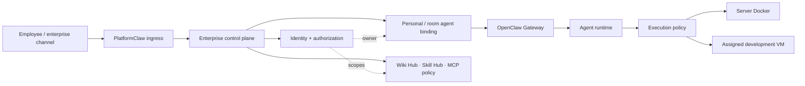

<div align="center">

# PlatformClaw

### Enterprise AI agents for real engineering work

**A private, multi-user AI agent platform built as a maintainable enterprise downstream of OpenClaw.**

Identity · Personal Agents · Organization · Wiki Hub · Skill Hub · Managed Execution

[Architecture](docs/platformclaw/index.md) · [Wiki Hub](docs/platformclaw/memory-wiki.md) · [Skill Hub](docs/platformclaw/skill-hub.md) · [Security](SECURITY.md) · [Development](#development)

[](https://github.com/devSejung/platformclaw/actions/workflows/platformclaw-ci.yml)
[](https://github.com/openclaw/openclaw)
[](LICENSE)

</div>

> [!NOTE]
> PlatformClaw is the enterprise product layer in this repository, not a renamed OpenClaw distribution.
> OpenClaw continues to own the agent runtime, sessions, channels, and plugin contracts; PlatformClaw
> adds enterprise identity, authorization, provisioning, knowledge, credentials, and execution policy
> behind maintainable downstream boundaries.
>
> PlatformClaw is under active enterprise deployment hardening. The implementation and rollout docs
> remain authoritative for production-readiness and cutover status.

## Why PlatformClaw

<table>
  <tr>
    <td width="33%" valign="top">
      <strong>Personal by default</strong><br><br>
      Each employee gets an isolated personal agent and browser session boundary instead of sharing one operator identity.
    </td>
    <td width="33%" valign="top">
      <strong>Shared where it matters</strong><br><br>
      Organization-aware Wiki Hub and Skill Hub make reusable knowledge and capabilities discoverable without flattening permissions.
    </td>
    <td width="33%" valign="top">
      <strong>Executes where work lives</strong><br><br>
      Agent work stays behind policy-controlled server or assigned-VM execution boundaries with server-side credential handling.
    </td>
  </tr>
</table>

PlatformClaw is designed for an engineering organization that wants the power of an always-available
agent platform without turning enterprise identity, shared knowledge, credentials, or execution targets
into ad-hoc prompt conventions.

## Platform surfaces

| Surface                        | What PlatformClaw adds                                                                                                                              |
| ------------------------------ | --------------------------------------------------------------------------------------------------------------------------------------------------- |
| **Identity & Personal Agents** | Enterprise authentication, opaque browser sessions, stable personal-agent provisioning, and user-scoped browser policy.                             |
| **Organization**               | One authorization model across Global, Team, Group, Part, and user membership, including join requests and delegated administration.                |
| **Memory & Wiki Hub**          | Personal and Shared Wikis with search, graph navigation, Markdown editing, attachments, ACLs, access requests, and explicit AI-reference selection. |
| **Skill Hub**                  | Internal skill catalog with publish/install workflows, exact versions, organization-aware access, ownership, and scanning policy.                   |
| **Managed Execution**          | Policy-routed server Docker or assigned development-VM execution, encrypted credential envelopes, brokered SSH handoff, and remote skill discovery. |
| **MCP Credentials**            | Administrator-approved MCP servers with employee-owned credentials kept behind the control boundary.                                                |
| **Enterprise Messaging**       | A private Knox channel boundary for personal DMs and group-room routing, kept outside OpenClaw core.                                                |
| **Operations UI**              | Employee and administrator surfaces for sessions, organization, work location, knowledge, skills, credentials, and platform operations.             |

The implementation is intentionally downstream-first: when OpenClaw already provides a generic seam,
PlatformClaw extends it instead of forking core behavior.

## How it fits together


```mermaid
flowchart LR
    U["Employee / enterprise channel"] --> I["PlatformClaw ingress"]
    I --> C["Enterprise control plane"]

    C --> ID["Identity + authorization"]
    C --> P["Personal / room agent binding"]
    C --> K["Wiki Hub · Skill Hub · MCP policy"]

    P --> G["OpenClaw Gateway"]
    G --> A["Agent runtime"]

    A --> E["Execution policy"]
    E --> D["Server Docker"]
    E --> V["Assigned development VM"]

    ID -. scopes .-> K
    ID -. owner .-> P
```

The ownership boundary is deliberate:

- **PlatformClaw owns** enterprise identity, browser authorization, organization policy, personal-agent
  provisioning, enterprise credentials, shared knowledge policy, and execution-target policy.
- **OpenClaw owns** the agent runtime, session model, Gateway, channel runtime, tools, skills,
  plugin contracts, and other generic agent infrastructure.

See [PlatformClaw architecture](docs/platformclaw/index.md) and
[project guidance](PLATFORMCLAW.md) for the detailed boundary.

## Using PlatformClaw

PlatformClaw is deployed as an enterprise service rather than installed by employees from npm.

1. **Sign in** through the configured enterprise authentication flow.
2. **Open your personal agent.** The control plane resolves the authenticated user and stable personal-agent binding.
3. **Choose the right work context.** Use the execution target permitted by the deployment; when an approved development VM is assigned, configure it from **Work location**.
4. **Bring in knowledge and capabilities.** Select Personal or Shared Wikis for AI reference and install approved skills from Skill Hub.
5. **Keep reusable work reusable.** Put durable knowledge in Wiki Hub and repeatable procedures in skills instead of burying them in one chat session.

### Wiki Hub

Open **Settings > Memory > Wiki Hub**.

- Personal and Shared Wikis use one catalog and reader/editor experience.
- Shared Wikis support Reader, Editor, and Owner roles plus user or organization grants.
- Search, graph navigation, Markdown documents, attachments, source downloads, and access requests are built into the same surface.
- Access and **AI reference** are separate: users can keep read access while excluding a Wiki from future agent turns.

Read the [Wiki Hub guide](docs/platformclaw/memory-wiki.md).

### Skill Hub

PlatformClaw connects the Skills page to a managed internal registry.

- Publish workspace skills without manually preparing a ZIP.
- Search the company catalog and inspect exact versions.
- Install into the personal agent's active workspace.
- Keep namespace, organization, ownership, visibility, and scanning policy server-side.

Read the [Skill Hub guide](docs/platformclaw/skill-hub.md).

## Security model

PlatformClaw treats enterprise boundaries as product behavior, not UI hints.

- Browser sessions use opaque server-managed tokens; authority is resolved on the server.
- Organization membership and Wiki access are re-evaluated through shared authorization services.
- Durable VM credentials are stored as encrypted envelopes and handed to execution through a bounded broker path.
- Browser users never receive Gateway operator credentials, stored passwords, or credential ciphertext.
- Enterprise-only behavior stays outside OpenClaw core whenever a control-plane, plugin, or policy boundary is sufficient.

Start with [employee authentication](docs/platformclaw/employee-auth.md),
[organization architecture](docs/platformclaw/organization-architecture.md),
[VM execution policy](docs/platformclaw/vm-execution-policy.md), and
[SECURITY.md](SECURITY.md).

## Development

This repository is a pnpm workspace. Windows is supported as the development host, while the
deployment/runtime target is Linux Docker; avoid Windows-only runtime dependencies.

```bash
pnpm install --frozen-lockfile
pnpm build
pnpm ui:build
```

For a focused PlatformClaw change:

```bash
node scripts/platformclaw-check.mjs --changed --quick
```

Before pushing a PlatformClaw PR, run the full changed-surface validation:

```bash
node scripts/platformclaw-check.mjs --changed
```

GitHub runs the PlatformClaw overlay workflow plus the relevant upstream-compatible checks.

## Documentation

| Goal                                            | Start here                                                                                                                    |
| ----------------------------------------------- | ----------------------------------------------------------------------------------------------------------------------------- |
| Understand the PlatformClaw / OpenClaw boundary | [PlatformClaw architecture](docs/platformclaw/index.md)                                                                       |
| Review current downstream project rules         | [PLATFORMCLAW.md](PLATFORMCLAW.md)                                                                                            |
| Work with Personal and Shared Wiki              | [Wiki Hub](docs/platformclaw/memory-wiki.md)                                                                                  |
| Publish or install company skills               | [Skill Hub](docs/platformclaw/skill-hub.md)                                                                                   |
| Understand organization and authorization       | [Organization architecture](docs/platformclaw/organization-architecture.md)                                                   |
| Configure employee authentication               | [Employee authentication](docs/platformclaw/employee-auth.md)                                                                 |
| Review VM execution and credential boundaries   | [VM execution policy](docs/platformclaw/vm-execution-policy.md) · [Credential broker](docs/platformclaw/credential-broker.md) |
| Operate development VMs                         | [VM administration](docs/platformclaw/vm-administration.md)                                                                   |
| Review enterprise messaging integration         | [Knox integration contract](docs/platformclaw/knox-proxy-spec.md)                                                             |
| Understand downstream sync state                | [Upstream and migration status](docs/upstream/status.md)                                                                      |

## Upstream relationship

PlatformClaw is maintained as an enterprise-oriented downstream of
[OpenClaw](https://github.com/openclaw/openclaw). The project deliberately keeps generic OpenClaw compatibility and enterprise-only behavior separate so upstream synchronization stays practical.

If you are looking for the general-purpose personal OpenClaw distribution, installers, community
channels, or public documentation, use the
[upstream OpenClaw repository](https://github.com/openclaw/openclaw).

## Contributing

Keep changes capability-focused and preserve the PlatformClaw / upstream ownership boundary.
Read [CONTRIBUTING.md](CONTRIBUTING.md) and [PLATFORMCLAW.md](PLATFORMCLAW.md) before changing shared
OpenClaw surfaces.

## License

Licensed under the [MIT License](LICENSE). See [THIRD_PARTY_NOTICES.md](THIRD_PARTY_NOTICES.md) for
incorporated or adapted third-party code and attribution.
