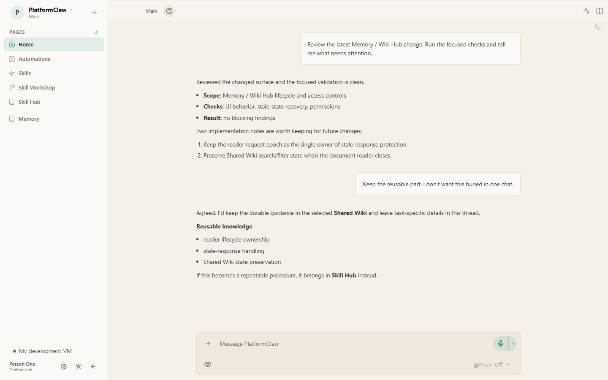
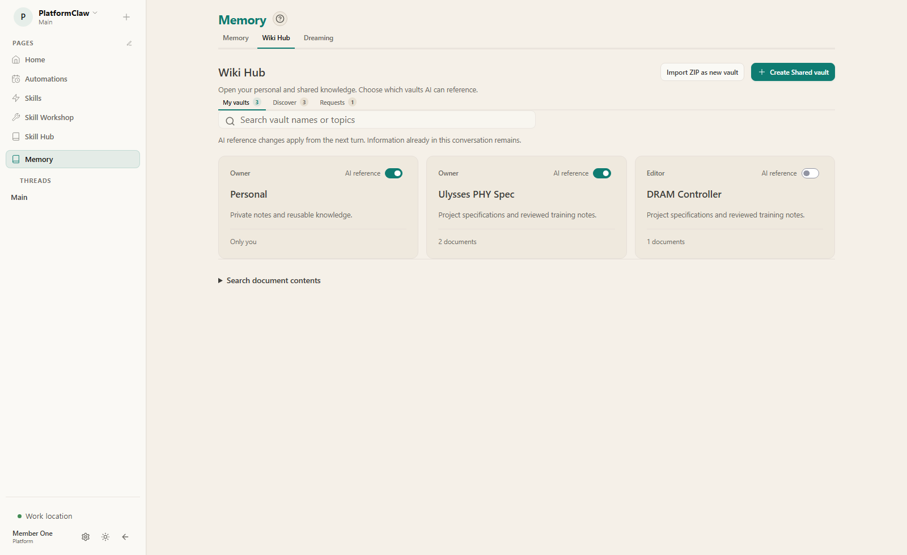
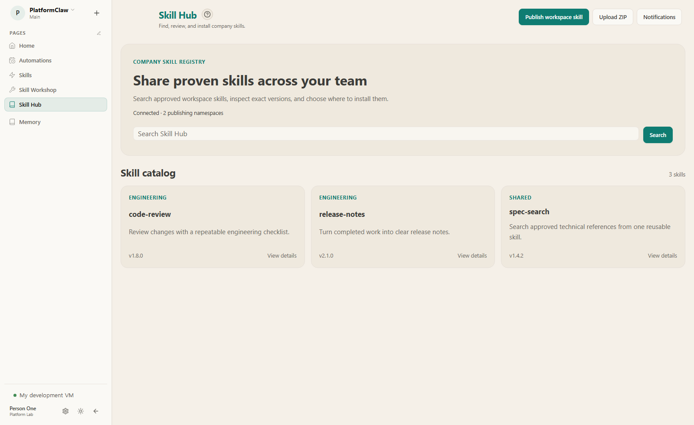
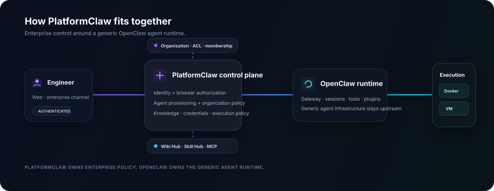

# PlatformClaw

<p align="center">
  <strong>Enterprise AI agents for real engineering work.</strong><br />
  Personal agents · shared knowledge · managed skills · governed execution
</p>

<p align="center">
  
</p>

<p align="center">
  Actual PlatformClaw Control UI rendered from this branch with deterministic demo data.
</p>

<p align="center">
  <a href="docs/platformclaw/index.md"><strong>Architecture</strong></a>
  ·
  <a href="docs/platformclaw/memory-wiki.md"><strong>Wiki Hub</strong></a>
  ·
  <a href="docs/platformclaw/skill-hub.md"><strong>Skill Hub</strong></a>
  ·
  <a href="SECURITY.md"><strong>Security</strong></a>
  ·
  <a href="#development"><strong>Development</strong></a>
</p>

<p align="center">
  <a href="https://github.com/devSejung/platformclaw/actions/workflows/platformclaw-ci.yml"></a>
  <a href="https://github.com/openclaw/openclaw"></a>
  <a href="LICENSE"></a>
</p>

PlatformClaw is a **private, multi-user AI agent platform** built as a maintainable enterprise downstream of OpenClaw. It keeps generic agent infrastructure upstream while adding the enterprise product layer around it: identity, authorization, personal-agent provisioning, shared knowledge, managed skills, credential policy, and execution routing.

## A product, not a prompt convention

<table>
  <tr>
    <td width="33%" valign="top">
      <h3>Personal by default</h3>
      Every employee gets a stable personal agent and an isolated browser/session boundary — not a shared operator identity.
    </td>
    <td width="33%" valign="top">
      <h3>Shared with control</h3>
      Organization-aware Wikis and skills make useful knowledge reusable without flattening ownership or permissions.
    </td>
    <td width="33%" valign="top">
      <h3>Execution with policy</h3>
      Agent work is routed to approved Docker or development-VM targets while durable credentials stay behind server-side boundaries.
    </td>
  </tr>
</table>

## Actual product surfaces

<table>
  <tr>
    <td width="50%" valign="top">
      
      <br /><br />
      <strong>Wiki Hub</strong><br />
      Personal and Shared Wikis, access-aware AI reference, vault search, and knowledge lifecycle in the real Control UI.
    </td>
    <td width="50%" valign="top">
      
      <br /><br />
      <strong>Skill Hub</strong><br />
      Search, inspect, publish, and install reusable company skills through the same product surface.
    </td>
  </tr>
</table>

<p align="center">
  These screenshots use the current PlatformClaw frontend and test-safe demo data; they are not design mockups.
</p>

## The PlatformClaw workspace

<table>
  <tr>
    <td width="50%" valign="top">
      <strong>IDENTITY · ISOLATION</strong><br /><br />
      <h3>Personal Agents</h3>
      Enterprise authentication, opaque browser sessions, stable personal-agent provisioning, and user-scoped browser policy.
    </td>
    <td width="50%" valign="top">
      <strong>KNOWLEDGE · ACCESS</strong><br /><br />
      <h3>Memory &amp; Wiki Hub</h3>
      Personal and Shared Wikis with search, graph navigation, Markdown editing, attachments, ACLs, access requests, and explicit AI-reference selection.
    </td>
  </tr>
  <tr>
    <td width="50%" valign="top">
      <strong>CAPABILITY · REUSE</strong><br /><br />
      <h3>Skill Hub</h3>
      Publish and install exact skill versions through a managed internal catalog with organization-aware access, ownership, and scanning policy.
    </td>
    <td width="50%" valign="top">
      <strong>DOCKER · DEVELOPMENT VM</strong><br /><br />
      <h3>Managed Execution</h3>
      Policy-routed server Docker or assigned development-VM execution with encrypted credential envelopes, brokered SSH handoff, and remote skill discovery.
    </td>
  </tr>
  <tr>
    <td width="50%" valign="top">
      <strong>SCOPE · AUTHORIZATION</strong><br /><br />
      <h3>Organization</h3>
      One authorization model across Global, Team, Group, Part, and user membership, including join requests and delegated administration.
    </td>
    <td width="50%" valign="top">
      <strong>MCP · MESSAGING</strong><br /><br />
      <h3>Enterprise Integrations</h3>
      Administrator-approved MCP servers, employee-owned credentials, and private enterprise messaging boundaries without hard-forking OpenClaw core.
    </td>
  </tr>
</table>

## One workflow, end to end

| Step                       | What happens                                                                                                        |
| -------------------------- | ------------------------------------------------------------------------------------------------------------------- |
| **01 · Sign in**           | Enterprise authentication resolves the employee and server-managed browser session.                                 |
| **02 · Open your agent**   | PlatformClaw reuses the stable personal-agent binding for that identity.                                            |
| **03 · Add context**       | Select the Personal or Shared Wikis and approved skills the next agent turn may use.                                |
| **04 · Do the work**       | The agent uses OpenClaw tools while PlatformClaw routes governed execution to the permitted target.                 |
| **05 · Keep what matters** | Durable knowledge goes back to Wiki Hub; repeatable procedures become skills instead of disappearing into one chat. |

> **Example**
>
> “Inspect this change, run the appropriate checks, explain the risky parts, and keep the reusable guidance in our Shared Wiki.”

The point is not another chat box. The point is a durable engineering workspace where **identity, context, execution, and reuse** are first-class product concepts.

## How it fits together

<p align="center">
  
</p>

The ownership boundary is deliberate. **PlatformClaw owns enterprise policy** — identity, browser authorization, organization access, personal-agent provisioning, shared knowledge policy, enterprise credentials, and execution targets. **OpenClaw owns the generic agent runtime** — Gateway, sessions, tools, skills, channels, and plugin contracts.

That split keeps PlatformClaw product behavior strong without turning every upstream sync into a rewrite.

## Built for governed engineering work

<table>
  <tr>
    <td width="25%" valign="top"><strong>Identity</strong><br />Opaque server-managed browser sessions. Authority is resolved on the server.</td>
    <td width="25%" valign="top"><strong>Authorization</strong><br />Organization and Wiki permissions are evaluated through shared policy services.</td>
    <td width="25%" valign="top"><strong>Credentials</strong><br />Durable VM secrets stay encrypted and cross the execution boundary through a bounded broker path.</td>
    <td width="25%" valign="top"><strong>Separation</strong><br />Enterprise-only behavior stays outside OpenClaw core whenever a control-plane or plugin boundary is sufficient.</td>
  </tr>
</table>

Start with [employee authentication](docs/platformclaw/employee-auth.md), [organization architecture](docs/platformclaw/organization-architecture.md), [VM execution policy](docs/platformclaw/vm-execution-policy.md), and [SECURITY.md](SECURITY.md).

## Product deep dives

| Area                       | Start here                                                                                                                                                                                  |
| -------------------------- | ------------------------------------------------------------------------------------------------------------------------------------------------------------------------------------------- |
| **Architecture**           | [PlatformClaw architecture](docs/platformclaw/index.md) · [Project guidance](PLATFORMCLAW.md)                                                                                               |
| **Knowledge**              | [Wiki Hub](docs/platformclaw/memory-wiki.md)                                                                                                                                                |
| **Skills**                 | [Skill Hub](docs/platformclaw/skill-hub.md) · [Skill Hub policy](docs/platformclaw/skill-hub-policy.md)                                                                                     |
| **Organization**           | [Organization architecture](docs/platformclaw/organization-architecture.md)                                                                                                                 |
| **Execution**              | [VM execution policy](docs/platformclaw/vm-execution-policy.md) · [Credential broker](docs/platformclaw/credential-broker.md) · [VM administration](docs/platformclaw/vm-administration.md) |
| **Messaging**              | [Knox integration contract](docs/platformclaw/knox-proxy-spec.md)                                                                                                                           |
| **Downstream maintenance** | [Upstream and migration status](docs/upstream/status.md)                                                                                                                                    |

## Development

This repository is a pnpm workspace. Windows is supported as the development host; the deployment/runtime target is Linux Docker.

```bash
pnpm install --frozen-lockfile
pnpm build
pnpm ui:build
```

For a focused PlatformClaw change:

```bash
node scripts/platformclaw-check.mjs --changed --quick
```

Before pushing a PlatformClaw PR:

```bash
node scripts/platformclaw-check.mjs --changed
```

GitHub runs the PlatformClaw overlay workflow plus the relevant upstream-compatible checks. See [CONTRIBUTING.md](CONTRIBUTING.md) before changing shared OpenClaw surfaces.

## Upstream relationship

PlatformClaw is maintained as an enterprise-oriented downstream of [OpenClaw](https://github.com/openclaw/openclaw). Generic OpenClaw compatibility stays upstream-shaped; enterprise-only behavior is added behind downstream control-plane, plugin, and policy boundaries.

If you are looking for the general-purpose personal OpenClaw distribution, installers, community channels, or public documentation, use the [upstream OpenClaw repository](https://github.com/openclaw/openclaw).

> [!NOTE]
> PlatformClaw is under active enterprise deployment hardening. The implementation and rollout documents are authoritative for production-readiness and cutover status.

## License

Licensed under the [MIT License](LICENSE). See [THIRD_PARTY_NOTICES.md](THIRD_PARTY_NOTICES.md) for incorporated or adapted third-party code and attribution.
